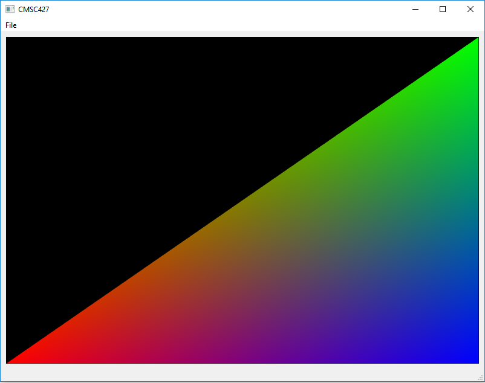
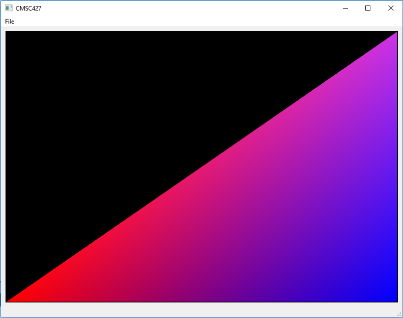
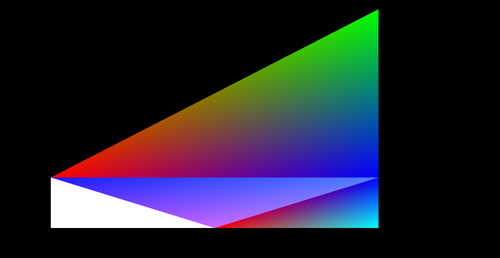
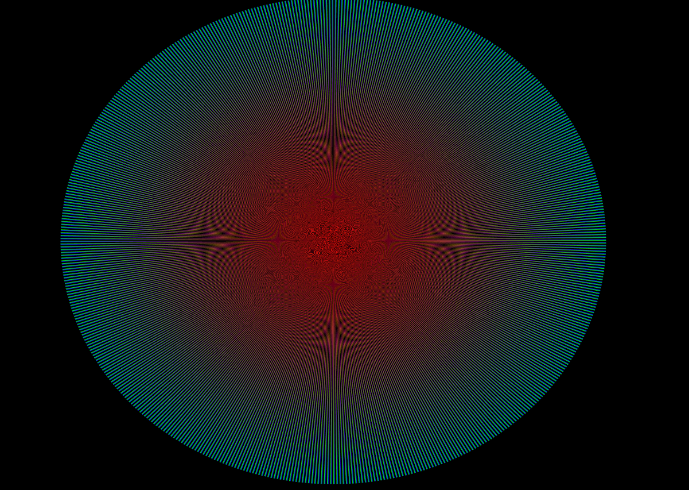

Authors - Mikhail Sorokin and Ruoyu Lei

Note - Use QtCreator for HelloWorld to compile and debug folder in TwoTriangle subfolders

HelloWorld2D Questions
----------
#Question 1

###What file contains the main() function, the starting point for the entire application?

cmsc427.cpp

#Question 2

###What classes are inherited by the class CMSC427Win? What classes are inherited by the class GLview?

CMSC427Win - QMainWindow and private class UI_CMSC427Win in the UI namespace

GLview - QOpenGLWidget and protected QOpenGLFunctions

#Question 3

###In the function CMSC427Win::keyPressEvent(), certain functions in the glwidget object are called based on what keys are pressed. What is the class type of glwidget? In what class is glwidget initialized?

Class Type - GLview

Initialized - ui_cmsc427.h

#Question 4

###How often is GLview::timerEvent() called while the application is running?

Every x (17) milliseconds until killTimer() is called.

[Got info from QT Documentation](http://doc.qt.io/qt-5/qobject.html#startTimer)

#Question 5

###How often is GLview::initializeGL() called while the application is running?

Gets called once before the first time resizeGL() or paintGL() is called.

[Got info from QT Documentation](http://doc.qt.io/qt-5/qopenglwidget.html)

#Question 6

###How often is GLview::paintGL() called while the application is running?

Gets called whenever the widget needs to be painted. The paintGL function would be called after timerEvent calls the update method and schedules a paint event for processing when Qt returns to the main event loop. This will be done sometime after the timerEvent method is called.

[Update Call](http://doc.qt.io/qt-5/qopenglwidget.html#paintGL)

[PaintGL Call](http://doc.qt.io/qt-5/qopenglwidget.html#paintGL)

#Question 7

###In GLview::paintGL(), there is a float variable called g_objScale that is passed to the shader program (called m_shader in the code). We will go into more detail about what a shader program is later in this course. This variable is responsible for defining how far to stretch the rectangle along the x axis. Based on the previous questions, how often is the value of g_objScale changed? What equation is used to update g_objScale?

It is changed every time the startEvent method is called and whenever the mouseMoveEvent is triggered
(after mousePressEvent is called).

Equation - ```g_objScale = 3*qSin(seed)```. In other words, this is a parameterized function which sets the scale between -1 and 1 as seed gets increased every 15 milliseconds (in other words, from a sin function).

#Question 7

###The file simple.fsh defines a fragment shader program. A fragment shader is compiled and run on your graphics card independent from the rest of the C++ code running on the CPU. Currently the fragment shader interpolates between the squirrel picture (denoted as texColor1 in the code) and the color spectrum background. Modify the fragment shader code so that the squirrel picture remains visible at all times. (Hint: only one line of code needs to be changed).

Remove lerper variable from simple.fsh and change line below it to this: fragColor = texColor1;

----------
**Triangle Questions**
===================
----------

#Question 9

###In the function GLview::initializeGL(), there is an array sqVerts defined as
```
float sqVerts[12] = {
 -.5, -.5, // xy coordinates of the first vertex
 .5, .5, // xy coordinates of the second vertex
 .5, -.5, // xy coordinates of the third vertex
};
```
###This defines the (x,y) coordinates for each vertex of the triangle. Through trial and error, modify the x coordinate of each vertex until each point of the triangle lies on the left/right border of the application window. What are the new (x,y) coordinates of each vertex of the triangle?

-.67,-.67,
.67,.67,
.67,-.67

#Question 10

###10) In the function GLview::initializeGL(), there is an array sqCol defined as
```
float sqCol[18] = {
1, 0, 0, // RGB value of the first vertex
0, 1, 0, // RGB value of the second vertex
0, 0, 1, // RGB value of the third vertex
};
```
###This defines the color at each vertex of the triangle. The amount of red, green, and blue (RGB) that will be at each vertex is specified in the real-value range of [0,1]. Now modify the code so that
```
float sqCol[18] = {
1, 0, 0, // RGB value of the first vertex
0.8, 0.2, 0.9, // RGB value of the second vertex
0, 0, 1, // RGB value of the third vertex
};
```
###In your own words, explain how this affects the triangle that is drawn. Include a screenshot before the code change and a screenshot after the code change.

Before, the fragment shader will linearly interpolate between fully red (1,0,0), green (0,1,0) and blue (0,0,1) values and afterwards, the color is interpolated between the first vertex that is fully red to the second, which is a mix of the colors between R, G and B - but mainly R and B - and the third vertex which is fully blue. So, afterwards the triangle is a blend mainly between the R and B values.




#Question 11

###The file simple.vsh defines a vertex shader program. A vertex shader program is executed and run on your graphics card independent from the rest of the C++ code running on the CPU. In simple.vsh, change the following line of code
```
gl_Position = vec4(aVertex.x * uVertexScale, aVertex.y * uVertexScale, 0, 1);
```
to
```
gl_Position = vec4(aVertex.x, aVertex.y * uVertexScale, 0, 1);
```
###In your own words, explain what visual difference this makes to the drawn triangle.

Instead of scaling uniformly (on both x and y), it just oscillates the triangle's scale vertically on the y axis and leaves the x scaling unchanged.

#Question 12

###While running the application, press the number “2”. Two triangles will be drawn. This is done by the function GLview::moreTriangles(). Modify GLview::moreTriangles() so that four triangles are drawn when the number 2 is pressed. Take a screenshot before the code change (with one triangle) and a screenshot after the code change (with four triangles). The triangles must not overlap each other and they can be any color(s) of your choice except all black (they will not be visible in this case).




#Question 13

###Modify the code in CMSC427_minimalGL_2D_twoTriangles so that a near-perfect multi-colored circle is drawn using triangles. Hint: near-perfect implies that enough triangles are used to draw the circle such that it looks like a perfect circle. Technically, it will still not be a circle. Screenshots of your creation are required for bonus credit.

# Assignment-1---Mikhail-Sorokin-and-Ruoyu-Lei
# Assignment-1---Mikhail-Sorokin-and-Ruoyu-Lei
